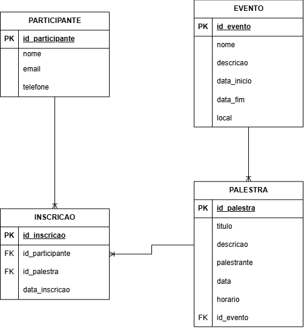

# Sistema de Eventos e Inscrições

## Tema

Sistema de banco de dados para gerenciamento de eventos, palestras, participantes e inscrições.

O sistema permite organizar eventos, cadastrar palestras vinculadas aos eventos, cadastrar participantes e registrar as inscrições dos participantes nas palestras.

## Estrutura do Banco de Dados

O banco de dados é composto pelas seguintes entidades:

- Participante
- Evento
- Palestra
- Inscrição

### Participante

Armazena os dados dos participantes:

- ID do participante
- Nome
- E-mail
- Telefone

### Evento

Armazena os dados dos eventos:

- ID do evento
- Nome
- Descrição
- Data de início
- Data de fim
- Local

### Palestra

Armazena as palestras relacionadas aos eventos:

- ID da palestra
- Título
- Descrição
- Palestrante
- Data
- Horário
- ID do evento

### Inscrição

Registra a participação de um participante em uma palestra:

- ID da inscrição
- ID do participante
- ID da palestra
- Data da inscrição

## Decisões de Modelagem

A entidade `Palestra` possui uma chave estrangeira `id_evento`, relacionando cada palestra a um evento.

A entidade `Inscrição` possui as chaves estrangeiras `id_participante` e `id_palestra`, permitindo relacionar participantes às palestras.

Foi utilizada uma restrição `UNIQUE` para impedir que o mesmo participante seja inscrito mais de uma vez na mesma palestra.

Os identificadores das entidades foram definidos como chaves primárias com `AUTO_INCREMENT`.

## DER

## Tecnologias

- MySQL
- MySQL Workbench 8.0
- Python
- mysql-connector-python